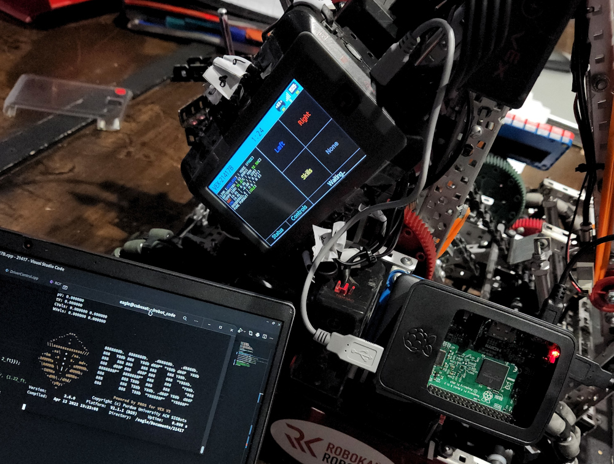

# Fast Wireless Development via Raspberry Pi

If you've been seriously developing V5 code for any length of time, you've probably already come to blows with the tradeoff between wired and wireless robot connections.

When you're wired into the robot, program upload times are blazing fast - but you can't stay jacked in while it's moving around. Furthermore, constantly disconnecting and reconnecting your programming cable is not just inconvenient... it can also be damaging. Due to shoddy engineering on VEX's part, the microUSB port on the Brain wears extremely easily and can even shear off the logic board if you're unlucky enough.

Wireless uploading via the controller solves these issues, but it's *painfully* slow (especially when you're trying to quickly iterate your code) and prone to errors and dropouts that waste even more time. If you're using the terminal provided by `pros-cli` over wireless, data transmission is also heavily throttled, limited to output-only and laden with decode errors.

Fortunately, there is a third way! Using a battery-powered Raspberry Pi (a cheap and popular microcomputer) and some networking black magic, you can "forward" the Brain's microUSB port to your development machine via Wifi. This setup nets the best of both worlds - the convenience of wireless **and** the speed and stability of wired.

{: .warn }
> **This setup requires you to use a Linux distribution on your development machine.** 
> 
> If you are using macOS (which is derived from BSD, making it a sort of distant sibling to Linux) you *might* be able to adapt this guide to it, but I make no promises. You'll need to find a version of `socat` that works with your macOS iteration.
> 
> Windows, however, is just far too primitive to support this level of advanced hackery.

While this would obviously be very illegal at a competition, it's a massive boon to programming everywhere else, and it can be had for $50 or less. If you're interested, read on!


*My original implementation, using a Pi 3B+ with a 5000mAh power bank.*

## Supplies

For this project, you'll need:
- A Raspberry Pi. 
  - I used a [Model 3B+](https://www.raspberrypi.com/products/raspberry-pi-3-model-b-plus/) since that's what I already had, but if you can get your hands on one I would recommend the [Zero 2 W](https://www.raspberrypi.com/products/raspberry-pi-zero-2-w/). Whatever you choose, just make sure it has a built-in Wifi chip.
  - A matching case is also a must, for ease of mounting and to prevent accidental damage.
- A microSD card for the Pi's OS. Since the Pi will only be acting as a relay and won't be storing or running anything aside from a few short scripts, you can probably just use any old card you have lying around. The only requirement is that it needs to be at least 8 gigabytes.
- A Li-ion battery pack.
  - I used [this](https://www.target.com/p/anker-powercore-iii-5000mah/-/A-83694729) Anker "deck of cards" pack from Target that fit the profile of my Pi quite nicely. If you get a Zero 2 W, I'd recommend [this](https://us.anker.com/products/a1109) lipstick pack instead.
  - 5000 mAh was enough to power my 3B+ for over eight hours, so if you're looking to save on cash you can probably go a lot smaller. Just make sure that it supplies enough voltage and amperage for your model of Pi.
- Two short (~6 inches) USB to microUSB cables, one for powering the Pi and the other for connecting it to the Brain.
  - For the Zero 2 W, you'll instead need one USB to microUSB cable (for power) and one USB on-the-go to microUSB cable (for the Brain).
- Some [velcro Command Strips](https://www.amazon.com/Command-Picture-Hanging-Container-PH206BLK-14NA/dp/B073XV1P16/ref=sr_1_3?crid=UTIV9MHUVWX0&keywords=Command%2BLarge%2BPicture-Hanging%2BStrips%2C%2BBlack%2C&qid=1650154062&sprefix=command%2Blarge%2Bpicture-hanging%2Bstrips%2C%2Bblack%2C%2Caps%2C88&sr=8-3&th=1) for mounting the whole assembly to your robot in a secure but removable fashion. I also used these to attach the battery pack to my Pi, but this may or may not work for you.

## Initial Setup

The first thing you'll need to do is set up the Pi's OS for headless (i.e. no screen/keyboard) operation. 

Since you should be using Linux, the easiest way to do this will be via the official `rpi-imager` package, which should be available via `apt`, `dnf` and `pacman`/`yay`.

Once installed, start up the program and plug in your microSD card.

1. Select `Choose OS` > `Raspberry Pi OS (other)` > `Raspberry Pi OS Lite (XX-bit)`. You'll probably want the 64-bit option, but if you have an older Pi you may need to choose 32-bit.
2. Select `Choose Storage` and pick your microSD card.
3. Go down to the bottom right and select the settings cog.
   1. Check `Set hostname` and enter a memorable name of your choice. We'll use this later to remotely connect to the Pi.
   2. Check `Enable SSH` and `Use password authentication`.
   3. Check `Set username and password` and configure the corresponding values to your liking.
   4. Check `Configure wifi` and enter in the details of your local Wifi network as well as your country. Make sure to double check!
   5. Save your choices and exit via the `Save` button at the bottom of the menu.
4. Hit `Write` to flash the OS!

Once `rpi-imager` is done flashing your microSD, slot it into your Pi and power it up. On your development machine, open up a terminal and SSH into the Pi:

```bash
...]$ ssh pi_hostname.local
```

{: .info }
> **It may take a while for your Pi to start accepting SSH connections.**
> 
> Give it a minute or two at first, especially with a slower model like the Zero.
> 
> If you still can't connect after waiting - and you're certain you configured the network information correctly - it's possible that your Wifi router is configured in such a way that your development machine is prevented from resolving the Pi's local IP address from its hostname. In this scenario, you have a few options:
> 
> 1. Find the Pi's local IP address using your router's configuration interface. 
> 2. Use a tool like `nmap` to identify all the machines on your local network, then identify the Pi from there. [Here](https://www.howtogeek.com/423709/how-to-see-all-devices-on-your-network-with-nmap-on-linux/) is a quick guide using `nmap`. Note that the scan may take a while - you can press `Enter` to see its progress. When it's done, look for a device manufactured by the Raspberry Pi Foundation.
> 3. Connect both the Pi and your development machine to a phone hotspot. Most phones will let you see the names and local IPs of every device connected - this is often the best solution, especially if you don't control the local Wifi network and/or it's extremely locked down. (School networks, for example, are notorious for blocking the kind of LAN connection we're trying to make.) 

If everything goes well, you should get a prompt asking for the password associated with the Pi's default user. Go ahead and login, then download [this](../resources/link_toolkit.zip) archive and extract it somewhere on your development machine.

You should see two shell script files - `link_start.sh` and `link_forward.sh`. Open the former in your text editor of choice, and replace both instances of `PI_HOSTNAME` with the actual hostname you set in `rpi-imager`. Save the file and move it to the root of your PROS project directory.

Go back to your SSH session with the Pi. Open a new text file in nano...

```bash
...]$ nano link_forward.sh
```

...and copy-paste in the contents of `link_forward.sh`. Save the file, then do `chmod +x` on it so you can run it as an executable.

We're almost ready! Shutdown the Pi and mount it to your robot in a secure location - on the back of your Brain is probably best, if you can get it to fit. 

Plug in the battery pack and Brain connection, then SSH back into your Pi and run the script as root using `sudo bash link_forward.sh`. On your development machine, do the same with the `link_start.sh` script. Ideally, you shouldn't see any errors and the connection will be established! 

To test it, you can run this in your PROS project:

```bash
...]$ pros upload . /dev/vex0
```

If everything is working correctly, this will upload your program to the robot at warp speed. Congrats!

{: .warn }
> **The Pi losing its connection to the Brain can cause issues.**
> 
> If the Pi is physically disconnected from the Brain, or if the Brain loses power, the wireless link will be dropped. Furthermore, a disconnection will often throw the Pi's serial port drivers out of wack, causing "inappropriate IOCTL" errors. 
> 
> While there's probably a way to fix this, I haven't found it. You're best off just rebooting the Pi when this happens and repeating the steps above to recreate the connection.

As a bonus, here's several aliases I added to my local `.bashrc` to make using the forwarded connection easier:

```bash
alias rpros_mu='pros make && pros upload . /dev/vex0'
alias rpros_mur='pros make && pros upload . /dev/vex0 --after run'
alias rpros_murt='pros make && pros upload . /dev/vex0 --after run && pros terminal /dev/vex1'
alias rpros_upload='pros upload . /dev/vex0'
alias rpros_run='pros v5 run 1 /dev/vex0'
alias rpros_stop='pros v5 stop /dev/vex0'
alias rpros_terminal='pros terminal /dev/vex1'
```

Enjoy!