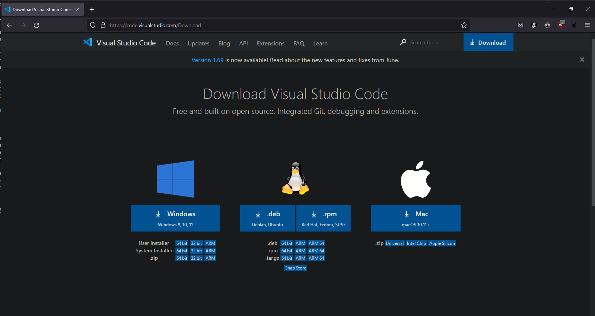
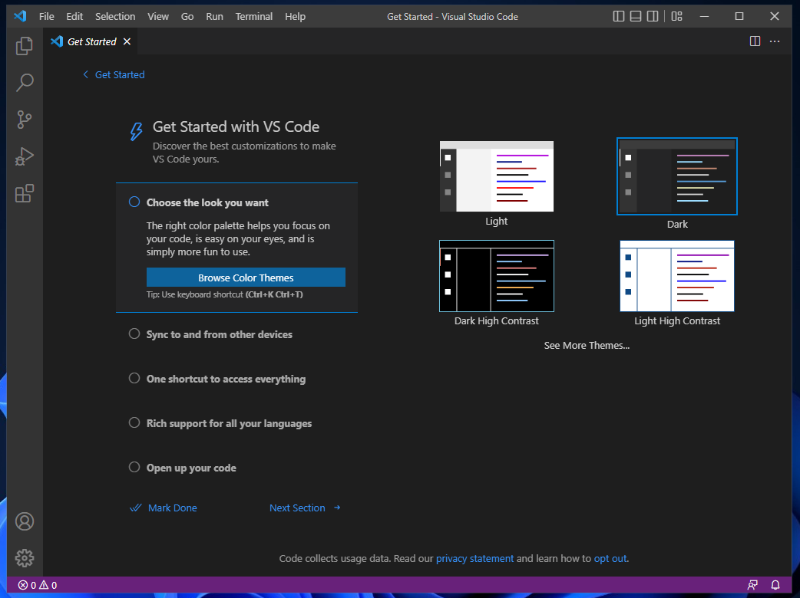
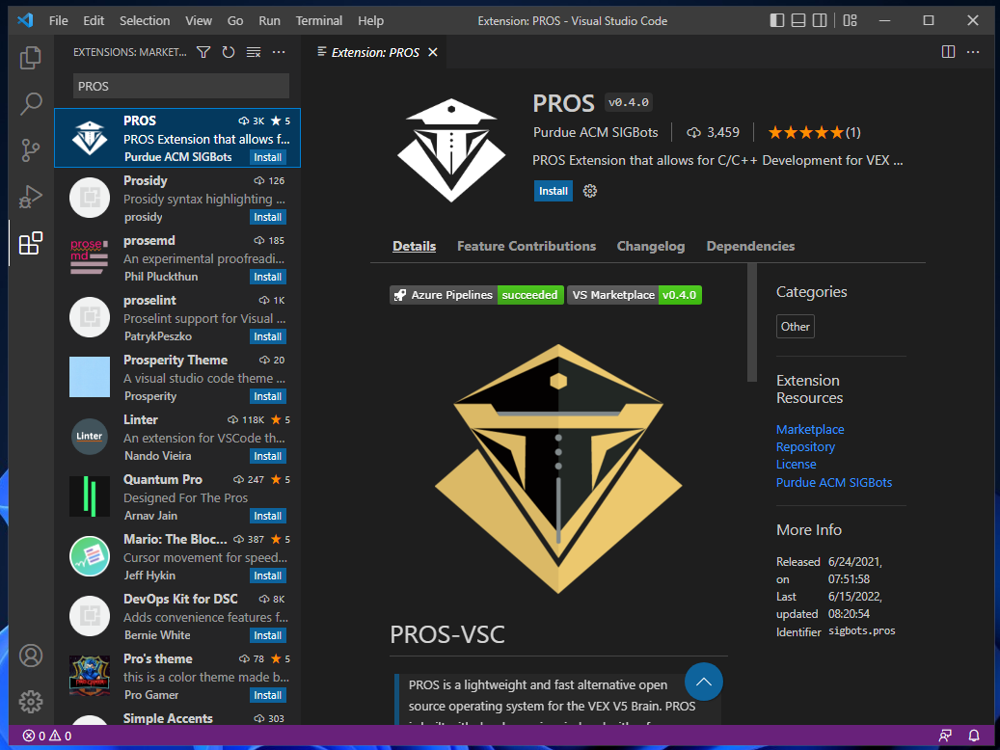
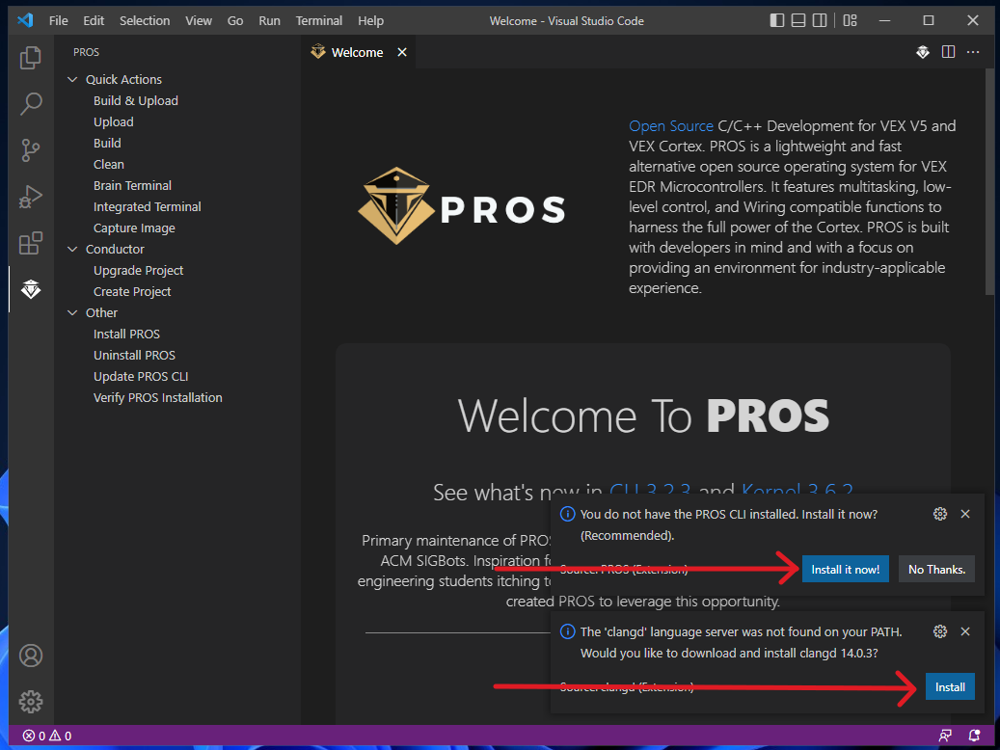
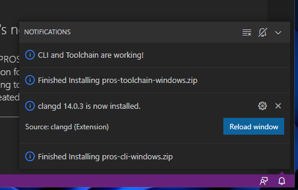
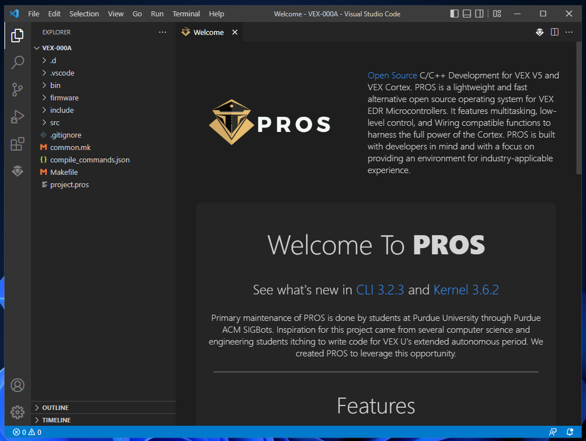

# Setup

Before we do anything, you'll need to install a few software packages. You may already have VEXCode Pro installed - if so, you can uninstall it. We're going to be using something much better: PROS.

PROS is an alternative kernel for the V5 Brain, written and maintained by students at Purdue University and officially endorsed by VRC and the REC. A "kernel" is a special piece of software that acts as a middleman between user programs (such as what you or I write) and the actual "bare metal" hardware of a computer; it's responsible for handling multitasking, managing memory, talking to peripherals (such as a keyboard or motor) and other low-level tasks that underpin the functionality of any modern computer.

<i>You're using a kernel - most likely the Windows NT kernel - <b>right now</b> to view this page.</i>

There are several advantages to using PROS - in no particular order, they include:

- A command-line based interface, which gives you the freedom to use *any* development environment to write your code.
- Richer capabilities in certain features, like multitasking and Brain display output. 
- The ability to easily integrate powerful third-party libraries into your project. PROS comes pre-bundled with two libraries that cover a lot of what you could want:
  - LVGL, a general-purpose GUI library that can be used to easily create complex interfaces on the Brain screen.
  - OkapiLib, a VEX-specific library which offers a variety of plug-and-play autonomous controllers as well as other useful tools like `QUnits`.
- Vastly superior documentation (compared to VEXCode) for both its toolchain and API.

## Installation

{: .info }
> **This guide assumes you are using Windows and have administrative privileges.** 
> - If you are using a different operating system, the following instructions should still work. Linux users may need to manually install the `arm-none-eabi-gcc` toolchain (or equivalent) through their distribution's package manager - more info can be found at the bottom of [this](https://pros.cs.purdue.edu/v5/getting-started/index.html) page.
> - If you do not have administrative privileges on your machine (say, because you use a school-provided or parentally-controlled laptop) then talk to your coach, network administrator, parent or other relevant authority figure.

In the past, installing PROS could be something of a headache, especially on Windows. Fortunately, the PROS team has since graciously created a "one-click" extension for Microsoft's Visual Studio Code editor to handle all that hassle for us!

To get started, you'll need to download and install Visual Studio Code (VSCode) from [here](https://code.visualstudio.com/Download).

Just hit the button for Windows. Once the installer finishes downloading, run it and click through to the end - the default settings are perfectly fine, although for convenience's sake you may want to enable the option to "Open with Code" from the file explorer context menu. It's presented on the second-to-last screen of the installer.

When the installation finishes, feel free to jump right in and open VSCode. We've got some extensions to install!

You should be presented with a screen like the one below:

If you'd like, you can change the color scheme. Once it's to your liking, open the `Extensions` drawer using <kbd>CRTL</kbd>+<kbd>SHIFT</kbd>+<kbd>X</kbd> or the fifth button from the top in the sidebar. This will present you with a sort of "app store" for VSCode extensions. In the search bar at the top, enter `PROS` to find the PROS extension; the author should be `Purdue ACM SIGBots`. Go ahead and install the extension.

Once it installs (it may take a few seconds), a new PROS icon should appear in your sidebar. Opening it should generate some notifications like the ones below. (If you miss them, they can be brought back via the little notification bell in the bottom right corner.)

These are prompting you to install the backend programs required for PROS to function - namely, the PROS CLI tool and a C++ compiler/toolchain. The former is how PROS communicates with the V5 Brain, while the latter is responsible for translating your code into something the Brain can understand - we'll discuss it more in future chapters.

For now, just hit install on both and *wait patiently.* The PROS toolchain can take several minutes to install, so it's best to just let it sit and work. Maybe go make a cup of tea?

Once installation is complete, your notification drawer should look like this:

Congratulations, PROS is installed!

## Project Setup

Now it's time to actually create a PROS project. 
1. Open the PROS menu from the sidebar if you haven't already, and select `Conductor` > `Create Project`. This will open a file select dialog prompting you for the storage location of the new project; your `Documents` or `Desktop` folder should probably be fine, as PROS will create a new subdirectory to hold all the project files.
2. PROS will then prompt you for the type of VEX device you want to target; just hit <kbd>ENTER</kbd> to select `v5`. 
3. The next prompt will ask for a project name - something like `VEX-MY_TEAM_NUMBER` is a good default.
4. The final prompt will ask which PROS version you want to use; just hit <kbd>ENTER</kbd> again to select `latest`.

PROS will take a moment to download some files and create the project. You will probably get a security prompt asking `Do you trust the authors of the files in this folder?` - just choose `Yes, I trust the authors` to enable full access.

Finally, you'll want to enable VSCode's autosave feature. Open the settings with <kbd>CTRL</kbd>+<kbd>,</kbd> and search for `autosave`, then set it to `afterDelay`. This will make sure any new changes are saved so the C++ compiler can pick up on them - trust me, it can be quite frustrating to wonder why your new code isn't working only to realize you merely didn't save the file.

Tada! You're now ready to program with PROS!

If you want, you can check that everything is working correctly by doing a test build - just select `PROS Menu` > `Quick Actions` > `Build`. You should see `Project Built!` if everything is OK. 

Once you're ready, head on to the next section to learn the basics of operator controls in PROS!