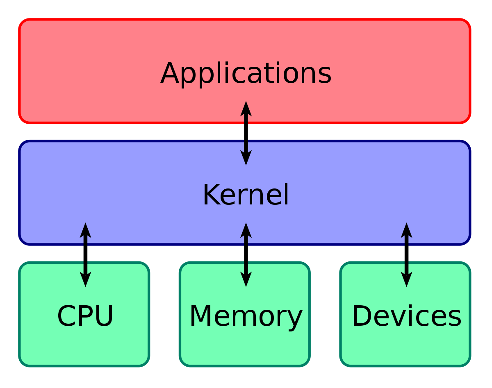

# Setup

Before we do anything, you'll need to install a few software packages. You may already have VEXCode Pro installed - if so, you can uninstall it. We're going to be using something much better: PROS.

PROS is an alternative kernel for the V5 Brain, written and maintained by students at Purdue University and officially endorsed by VRC and the REC. A "kernel" is a special piece of software that acts as a middleman between user programs (such as what you or I write) and the actual "bare metal" hardware of a computer; it's responsible for handling multitasking, managing memory, talking to peripherals (such as a keyboard or motor) and other low-level tasks that underpin the functionality of any modern computer.

<i>You're using a kernel - most likely the Windows NT kernel - <b>right now</b> to view this page.</i>

There are several advantages to using PROS - in no particular order, they include:

- A command-line based interface, which gives you the freedom to use *any* development environment to write your code.
- Richer capabilities in certain features, like multitasking and basic Brain display output. 
- The ability to easily integrate powerful third-party libraries into your project. PROS comes pre-bundled with two libraries that cover a lot of what you could want:
  - LVGL, a general-purpose GUI library that can be used to easily create complex interfaces on the Brain screen.
  - OkapiLib, a VEX-specific library which offers a variety of plug-and-play autonomous controllers as well as other useful tools like `QUnits`.
- Vastly superior documentation (compared to VEXCode) for both its toolchain and API.