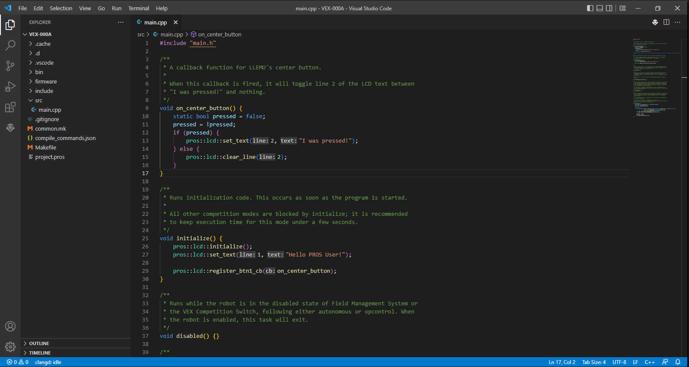

# A Warm-Up: Implementing Operator Control

Now that you have PROS installed and a project set up, let's get cracking with some operator control code!

To start you off, PROS has created a source file at `src` > `main.cpp`. Go ahead and open it; you should see a handful of template and demonstration functions.



This file defines all the functions managed by the PROS kernel. If you've used VEXCode Pro, these will look familiar to you, but they're handled somewhat differently. There's no need to call functions like `vexcodeInit();` or set up callbacks to auton and driver control in `main` - it's all taken care of in the background when the right conditions are met.

Here's a quick reference for all PROS-managed functions:

| Function | Start Conditions | Example Use Cases |
-----------|------------------|-------------------|
| `initialize()` | Runs once on program start. Blocks autonomous/driver control from starting until complete. | Setting up brake modes, starting driver control tasks, running sub-system initialization functions |
| `disabled()` | Runs whenever the field switches the robot to disabled. Terminates automatically when the robot is enabled. |  Cancelling stuck auton routines before driver control starts, setting brakes to hold mode |
| `competition_initialize()` | Runs automatically after `initialize()` if the robot is connected to a field or competition switch. | Competition-specific initialization routines, such as a specialized auton selector. |
| `autonomous()` | Runs whenever the field starts the autonomous period, or when manually called from elsewhere. Terminated automatically when the robot is disabled or communications are lost. | Autonomous routines. |
| `opcontrol()` | Runs whenever the field starts the driver control period, or automatically after `initialize()` if no competition control is connected. Terminated automatically when the robot is disabled or communications are lost. | Driver control code, or starting driver control tasks. |

For now, we only need to worry about `initialize()` - we're going to use it to launch our driver controls. Hit <kbd>ENTER</kbd> above `initialize()` a few times to create some whitespace - due to the way C++ works, code can't "see" anything below it in the file without taking specific steps - and create a function called `tankControl()`. (If they bug you, you can also strip out the comments above each function.)

```cpp
void tankControl()
{

}

//vvv initialize() vvv
```

Now add a `while(true)` loop with a 10-millisecond call to `pros::delay()`.

```cpp
void tankControl()
{
    while(true)
    {
        pros::delay(10);
    }
}
```

{: .danger }
> **The `pros::delay()` call and `while(true)` loop are *extremely* important.** 
> - The former essentially gives the Brain "breathing room," freeing up the processor to do other things while the loop is delayed. Without it, you'll likely see weird behavior due to the loop constantly demanding processor time.
> - The latter stops the function from exiting; without it, it would only take driver inputs once then silently stop.

Okay, so now we have an efficient looping function intended for feeding controller inputs to the motors.

...How do we do that, exactly?

Time to meet your new favorite website: [the PROS C++ API](https://pros.cs.purdue.edu/v5/api/cpp/index.html)! This is the comprehensive online reference for how to make PROS talk to your robot and generally Do Observable Things™. You should bookmark it. No, seriously, do it right now. 

Now, in our case, we want to interface with the controller and motors; let's start with the latter, which has its own API page [here](https://pros.cs.purdue.edu/v5/api/cpp/motors.html).

Yes, I know that's a *super* long bullet point list, but we don't need most of it. Just scroll down to the first section, called `Constructor(s)` - every PROS API device page will have this section, as it tells you how to create ("construct") the variable associated with that device. This differs from VEXCode Pro, which has you configure your devices in a menu then creates the associated variable for you.

So, we need to construct our motor variables - better known as motor "objects" - before we can use them. Fortunately, it's pretty easy. According to the API, the simplest form of the `pros::Motor` constructor just requires a Brain port number, like so: `pros::Motor motor (1);`. (You can see this by selecting the "example" tab of the last possible constructor.)

You can construct your motor objects outside a function so they are globally accessible like in VEXCode, or you can construct them at the top of your control function (outside the loop) to keep things simple. To start we'll do the latter:

```cpp
void tankControl()
{
    pros::Motor front_left (1);
    pros::Motor front_right (2);
    pros::Motor back_left (3);
    pros::Motor back_right (4);
    while(true)
    {
        pros::delay(10);
    }
}
```

{: .info }
> I'm going to assume that you're using a four-motor skid-steer drive base without any complicated gearing, but this general concept can be adapted to something more exotic. Whatever you do, *make sure to use the correct port numbers*!

Alright, we have our motors initialized. Now we just need to make them move, so let's scroll down.

This section under `Operator Overloads` looks like exactly what we need: 
> "Sets the voltage for the motor from -127 to 127. **This is designed to map easily to the input from the controller’s analog stick for simple opcontrol use.**" 
 
The example tab even shows how to construct a controller object, so we don't have to look up the controller API!

The provided example shows how to set the output of one motor:

```cpp
void opcontrol() 
{
  pros::Motor motor (1, E_MOTOR_GEARSET_18);
  pros::Controller master (E_CONTROLLER_MASTER);
  while (true) 
  {
    motor = master.get_analog(E_CONTROLLER_ANALOG_LEFT_Y);
    pros::delay(2);
  }
}
```

Seems easy enough. The only thing of note is that we'll want to use joystick axes besides `LEFT_Y`, but the pattern is obvious - and the available options are also provided in the controller API. (It's [here](https://pros.cs.purdue.edu/v5/api/cpp/misc.html#pros-controller), for the curious.)

Let's adapt it to our code, assuming `LEFT_Y` for the left motors and `RIGHT_Y` for the right motors:

```cpp
void tankControl()
{
    pros::Motor front_left (1);
    pros::Motor front_right (2);
    pros::Motor back_left (3);
    pros::Motor back_right (4);
    pros::Controller master (E_CONTROLLER_MASTER);
    while(true)
    {   
        front_left = master.get_analog(E_CONTROLLER_ANALOG_LEFT_Y);
        back_left = master.get_analog(E_CONTROLLER_ANALOG_LEFT_Y);
        front_right = master.get_analog(E_CONTROLLER_ANALOG_RIGHT_Y);
        back_right = master.get_analog(E_CONTROLLER_ANALOG_RIGHT_Y);
        pros::delay(10);
    }
}
```

Annnnd we're done! The only thing left to do is start this function as a *task* from elsewhere, specifically `initialize()`.

```cpp
void initialize()
{
    pros::lcd::initialize();
    pros::lcd::set_text(1, "Hello PROS User!");
    
    pros::lcd::register_btn1_cb(on_center_button);

    pros::Task tank(tankControl); //This line starts the tank control task.
}
```

Go ahead and plug the Brain or V5 controller into your computer and click the little PROS logo in the top right - this will build and upload your project to the robot. Once you get the all-clear, launch the program and you should be able to drive your robot around!

Now that you have the basics down, get more practice on your own by writing control functions for other components on your robot, like claws or pistons. Use the PROS API documentation to learn how to use the other buttons on your controller and talk to devices like pneumatic solenoids. If you'd like examples, check out my code [here](https://github.com/SomewhereOutInSpace/VEX-21417B/blob/master/src/Other/DriverControl.cpp).

{: .info }
> This design pattern of splitting up driver control into little sub-modules is not technically necessary; I just like it because it keeps things neatly separated, helps teach tasks out of the gate, and doesn't have any tangible overhead. 
> 
> There is nothing wrong with putting all of your driver control code into `opcontrol()` if you so choose - in fact, it may make some advanced stuff easier.

Once you're comfortable with driver control and the PROS API docs, move on to learn about what *not* to do for autonomous.